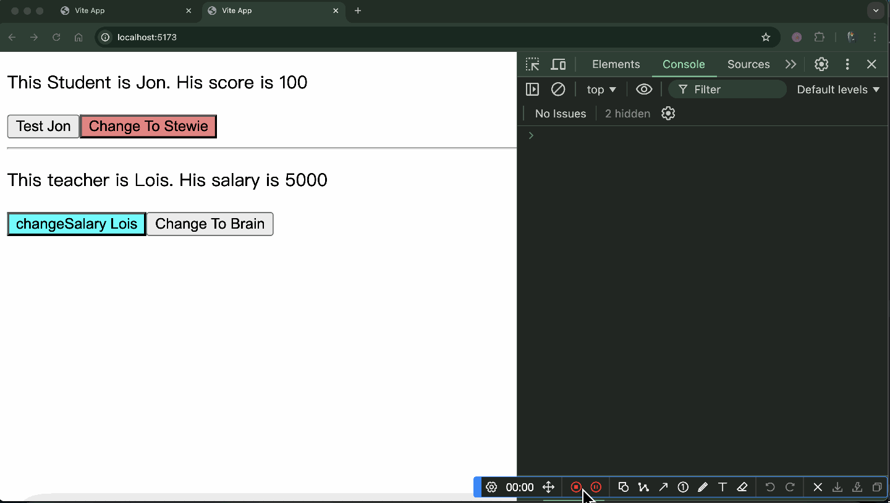
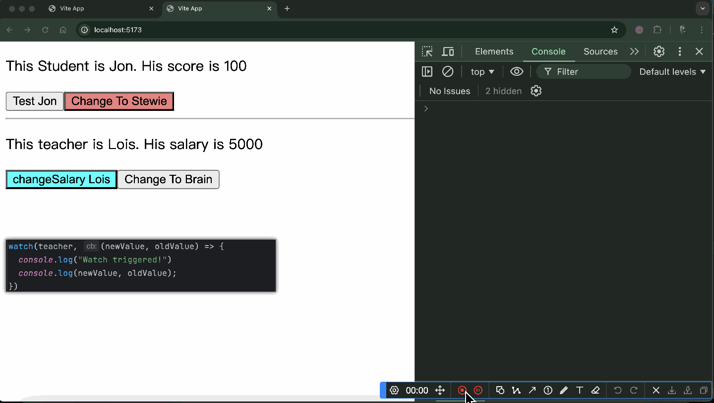
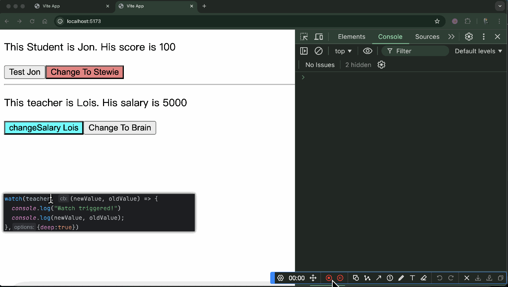

# Two bugs of vue@3.5.12
# 1 Vue fails to deal with a ref Object when watch triggered by the change of the reference of this ref Object
In [Student.vue](src%2Fcomponents%2FStudent.vue), if you click button 'Change To Stewie',then vue will fail to deal with this ref Object.
The button 'Change To Stewie' just change the reference of the 'student' to a new Object `{name:"Stewie", salary: 0}`.

# 2 by the change of a property of a ref Object
According to the document:
> deep: force deep traversal of the source if it is an object, so that the callback fires on deep mutations.  
> https://vuejs.org/api/reactivity-core.html#watch

But in [Teacher.vue](src%2Fcomponents%2FTeacher.vue), an object 'teacher' is passed to watch,  
Only if {deep:true} is added, then changeSalary() will trigger watch;  
Whether {deep:true} is added or not, changeToBrain() always triggers watch;  
Firstly，when {deep:true} is not added, a change of a property or the entire Object leads to different performance of watch, 
the first one doesn`t trigger watch, the second one triggers watch;  
Secondly,the document tells that 'force deep traversal of the source if it is an object',but you have to add {deep:true},
I dont know if this is a problem of the code or the document.  

